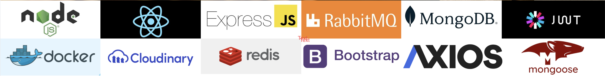
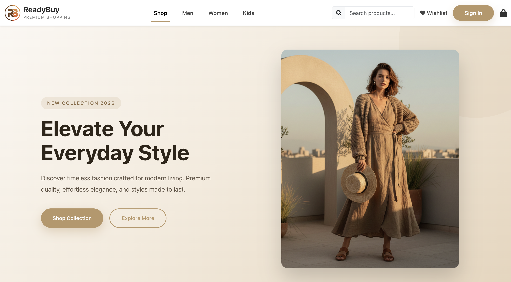
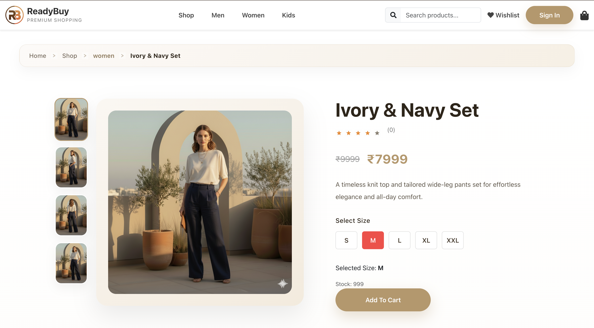
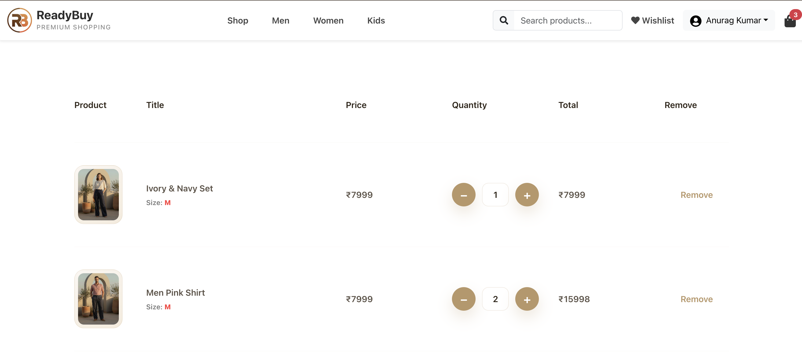
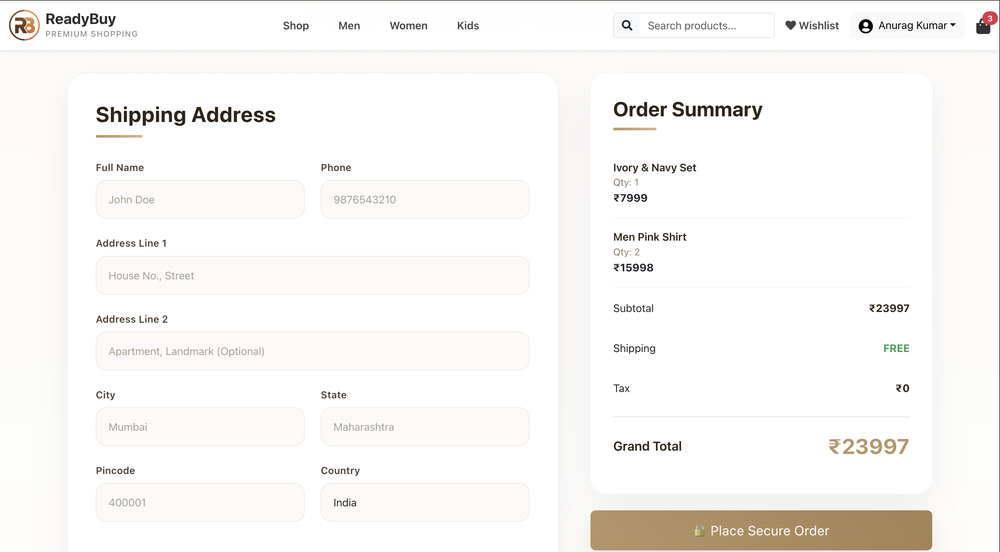
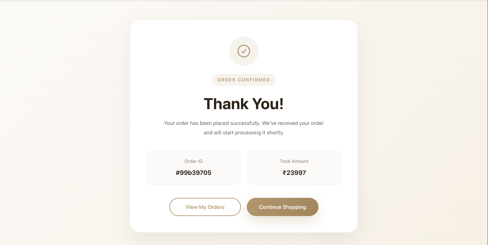
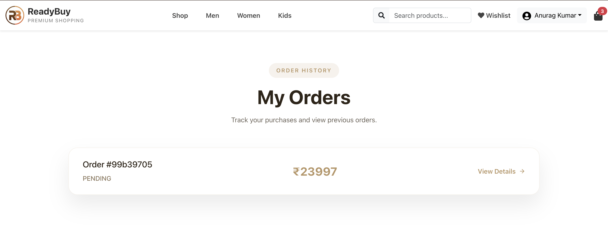
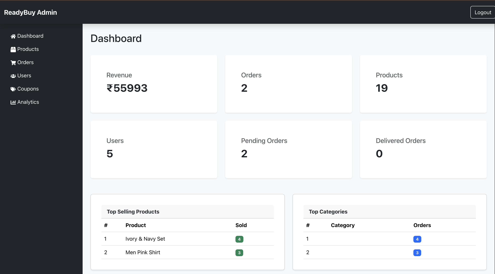
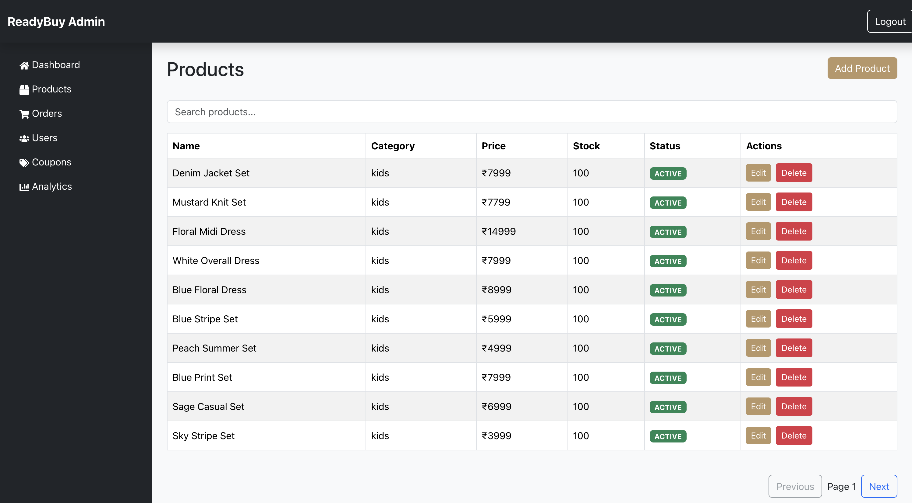

# ReadyBuy - Enterprise MERN E-Commerce Platform

<div align="center">


### A Production-Ready Enterprise MERN E-Commerce Platform

*Designed with Scalability, Performance, Security, and Modern System Design Principles.*

<p align="center">
  <a href="https://readybuy-six.vercel.app">
    
  </a>
  <a href="https://readybuy.onrender.com">
    
  </a>
  <a href="https://github.com/Anurag-3112/ReadyBuy-E-commerce/wiki">
    
  </a>
</p>

---



</div>

---

# About The Project

ReadyBuy is a **production-ready enterprise-level E-Commerce platform** built using the **MERN Stack** while following modern software engineering principles and scalable system design.

Unlike traditional CRUD-based college projects, ReadyBuy has been architected as a real-world e-commerce application inspired by platforms such as **Amazon, Flipkart, Myntra, and Shopify**.

The project demonstrates not only frontend and backend development but also **distributed system concepts**, **performance optimization**, **clean architecture**, and **scalable backend design**, making it an ideal portfolio project for software engineering and full-stack development roles.

The primary objective of this project is to showcase the implementation of:

- Enterprise MERN Architecture
- Authentication & Authorization
- Scalable Backend Design
- High Performance APIs
- Caching Strategies
- Asynchronous Processing
- Secure Payment Workflow
- Admin Management Portal
- Analytics Dashboard
- Production Deployment

[Read more](#system-design--architecture)


---

# Demo

## Home Page



---

## Product Listing


---

## Product Details



---

## Shopping Cart



---

## Checkout



---

## Order Placed



---

## Order History


order-placed
---

## Admin Dashboard



---

## Product Management



---


# Project Goals

* Build a **production-ready MERN application**
* Design a **scalable and maintainable backend architecture**
* Implement **enterprise-grade authentication and authorization**
* Improve application performance using **Redis caching**
* Enable **asynchronous processing with RabbitMQ**
* Build a **fully functional Admin Dashboard**
* Demonstrate **real-world System Design concepts**
* Follow **Clean Code and SOLID principles**
* Maintain a **recruiter-friendly, industry-standard architecture**


---

# Key Highlights

### Authentication & Authorization

* JWT Authentication with Refresh Tokens
* Protected Routes
* Role-Based Access Control (RBAC)
* Separate Admin and Customer Access

### E-Commerce Features

* Product Search, Filtering & Categories
* Shopping Cart & Checkout
* Coupon System
* Order Management & Tracking
* User Profile Management

### Admin Dashboard

* Product, User, Order & Coupon Management
* Revenue & Sales Analytics
* Top Products & Categories
* Low Stock Monitoring

### Performance & Scalability

* Redis Caching
* Pagination & Optimized Database Queries
* React Query for Efficient Data Fetching
* RabbitMQ for Asynchronous Processing
* Image Optimization with Cloudinary

### Production Ready

* Docker & Docker Compose
* MongoDB Atlas
* Cloudinary
* Production Deployment Ready

---

<h2>Tech Stack</h2>

<table>
  <tr>
    <th>Frontend</th>
    <th>Backend</th>
    <th>DevOps & Tools</th>
  </tr>
  <tr>
    <td valign="top">

  React 19  
    React Router  
    TanStack React Query  
    Axios  
    Bootstrap 5  
    Chart.js

  </td>
  <td valign="top">

  Node.js  
    Express.js  
    MongoDB & Mongoose  
    JWT & Bcrypt  
    Redis & RabbitMQ  
    Cloudinary  
    Zod

  </td>
  <td valign="top">

  Docker  
    Docker Compose  
    Git & GitHub  
    Postman  
    MongoDB Compass

  </td>
  </tr>
</table>


---

# Current Project Status

| Module | Status |
|:---|:---:|
| Authentication | **Complete** |
| Customer Store | **Complete** |
| Admin Dashboard | **Complete** |
| Products | **Complete** |
| Categories | **Complete** |
| Orders | **Complete** |
| Coupons | **Complete** |
| Analytics | **In Progress** |
| Payment Gateway | **Ready for Integration** |
| Deployment | **Complete** |

---


# System Design & Architecture

One of the primary goals of **ReadyBuy** is to demonstrate **enterprise software architecture** rather than just implementing CRUD operations.

The application follows a **layered architecture**, making it scalable, maintainable, and suitable for real-world production environments.


---

# High Level Architecture

```text
                                    CLIENT

                           React + React Query
                                   │
                    ───────────────────────────
                                   │
                             REST API (HTTPS)
                                   │
                    ───────────────────────────
                                   │
                            Express.js Server
                                   │
        ┌──────────────┬──────────────┬──────────────┐
        │              │              │              │
 Authentication   Product Module   Order Module   Admin Module
        │              │              │              │
        └──────────────┴──────────────┴──────────────┘
                                   │
                      Business Service Layer
                                   │
                           Repository Layer
                                   │
          ┌───────────────┬──────────────┬──────────────┐
          │               │              │              │
      MongoDB          Redis        RabbitMQ      Cloudinary
```

## Architecture Principles
- Modular architecture
- Service–Repository pattern
- Separation of concerns
- RESTful API design
- JWT authentication and RBAC
- Redis caching
- RabbitMQ asynchronous processing
- React Query server-state management
- Cloudinary media storage

For detailed architecture and engineering decisions:

[Read System Design Documentation →](https://github.com/Anurag-3112/ReadyBuy-E-commerce/wiki/High-Level-Architecture)

---

# 📈 Scalability Strategy

The architecture has been designed to accommodate future growth.

Potential enhancements include:

- Microservices
- Kubernetes Deployment
- Elasticsearch
- Event-Driven Architecture
- Multi-Vendor Marketplace
- AI Recommendations
- Inventory Service
- Notification Service

---


# Repository Structure

```text
ReadyBuy/
│
├── frontend/
│
├── backend/
│
├── docs/
│   ├── images/
│   └── architecture/
│
├── docker/
│
├── README.md
│
└── docker-compose.yml
```

---


# Documentation

| Area | Documentation |
|:---|:---|
| Architecture | [System Architecture →](https://github.com/Anurag-3112/ReadyBuy-E-commerce/wiki/High-Level-Architecture) |
| Backend | [Backend Architecture →](https://github.com/Anurag-3112/ReadyBuy-E-commerce/wiki/Backend-Architecture) |
| Frontend | [Frontend Architecture →](https://github.com/Anurag-3112/ReadyBuy-E-commerce/wiki/Frontend-Architecture) |
| Database | [Database Design →](https://github.com/Anurag-3112/ReadyBuy-E-commerce/wiki/Database-Design) |
| API | [API Documentation →](https://github.com/Anurag-3112/ReadyBuy-E-commerce/wiki/API-Overview) |
| Deployment | [Deployment Guide →](https://github.com/Anurag-3112/ReadyBuy-E-commerce/wiki/Deployment) |

---

# Why ReadyBuy?

Most academic MERN projects stop after implementing basic CRUD operations.

ReadyBuy goes beyond that by focusing on **real-world software engineering practices**, including:

- Layered backend architecture
- Service–Repository pattern
- Role-based authorization
- API optimization
- Caching strategies
- Queue-based asynchronous processing
- Scalable folder organization
- Modular React architecture
- Admin analytics dashboard
- Enterprise deployment readiness

These design decisions make the project a strong demonstration of full-stack engineering skills rather than just frontend or backend development.

---

# Roadmap

### Completed

- Authentication
- Products
- Categories
- Cart
- Checkout
- Orders
- Coupons
- Admin Dashboard
- Analytics Dashboard

### Planned

- Reviews & Ratings
- Wishlist
- Payment Gateway Integration
- Notifications
- AI Product Recommendations
- Returns & Refunds
- Loyalty Program
- Multi-language Support

---


# Contributing

Contributions are welcome.

Steps:

1. Fork the repository
2. Create a feature branch

```bash
git checkout -b feature/new-feature
```

3. Commit changes

```bash
git commit -m "Add new feature"
```

4. Push

```bash
git push origin feature/new-feature
```

5. Create a Pull Request

---


# License

This project is licensed under the **MIT License**.

See the [LICENSE](LICENSE) file for details.

---

# Author

**Anurag Kumar**

- GitHub: https://github.com/Anurag-3112
- LinkedIn: *https://linkedin.com/in/anurag-kumar-work*
- Portfolio: *https://anuragkumar-portfolio.vercel.app/*

---

# Acknowledgements

Special thanks to the open-source community and the maintainers of the technologies that made this project possible:

- React
- Node.js
- Express.js
- MongoDB
- Redis
- RabbitMQ
- TanStack Query
- Bootstrap
- Cloudinary
- Docker

---

# Support

If you found ReadyBuy useful, consider giving the repository a ⭐.
